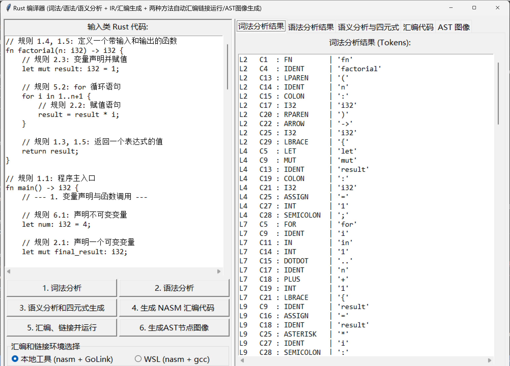

# 类-Rust 可视化编译器 (Rust-like Visual Compiler)

这是一个为编译原理课程设计的、功能完备的编译器项目。它能够对一种类-Rust语法的简化语言进行完整的**词法分析**、**语法分析**、**语义分析**，并最终生成**x86-64汇编代码**。整个编译流程通过一个使用`Python`和`tkinter`构建的图形用户界面(GUI)进行可视化展示，并能调用WSL或是本地工具实现两种操作系统环境下的汇编、链接和运行。

-----

## 📸 可视化界面展示 (Visual Showcase)

我们设计的GUI旨在将抽象的编译过程变得直观易懂。

#### 主界面

左侧为功能完备的代码编辑器（支持从 `test.rs` 文件自动加载），右侧为多标签页的结果展示区，整体布局清晰，操作方便。


#### 多阶段结果分析

用户可以方便地切换标签页，查看词法、语法、语义分析、中间代码（四元式）和最终生成的汇编代码。


#### 双环境汇编链接和执行

点击按钮后可以将生成的汇编代码在两种操作系统的环境下通过汇编和链接后运行，界面中输出控制台结果和程序的返回码（main函数的返回值,如果是wsl的话还要再%256）


#### 抽象语法树 (AST) 可视化

生成的AST图像支持交互式的缩放与平移，可使用鼠标、按钮和拖动条来调整图像大小和位置，便于分析复杂的语法结构。


-----

## 🚀 如何使用 (How to Use)

在开始之前，请确保你的环境已配置好 **Python 3.11+** 和 **WSL (Windows Subsystem for Linux)**。

#### 1\. 环境配置

首先，克隆或下载本仓库至本地。然后进入项目根目录，通过以下命令安装所需的依赖库：

```bash
pip install -r requirements.txt
```

#### 2\. 配置WSL环境

本项目可以支持 **WSL** 汇编、链接和执行生成的汇编代码。请确保你已经在WSL环境中安装了 `nasm` 和 `gcc`。

```bash
# 在你的WSL发行版中（如Ubuntu）运行
sudo apt update
sudo apt install nasm gcc
```

#### 3\. 运行程序

本项目依赖 **Graphviz** 进行AST的可视化，同时支持 **Windows本地链接和执行** ，我们已将Windows版本的Graphviz二进制文件打包在`graphviz_bin`目录中，同时将所需的GoLink.exe和nasm.exe打包在了`compiler_tools`目录中。

  - **重要提示**: 请确保 `graphviz_bin` 和 `compiler_tools` 文件夹与 `gui.py` 位于同一目录下。
  - 在项目根目录下，执行以下命令来启动GUI应用程序：

<!-- end list -->

```bash
python gui.py
```

#### 4\. 使用步骤

程序启动后，将自动从同目录下的 `test.rs` 文件加载示例代码。你可以直接使用或修改代码，然后按照界面左侧按钮的顺序进行操作：

1.  **点击 "1. 词法分析"**: 在右侧“词法分析结果”标签页中查看生成的Token序列。
2.  **点击 "2. 语法分析"**: 在“语法分析结果”标签页中查看AST的文本结构或语法错误。
3.  **点击 "3. 语义分析和 IR 生成"**:
      * 如果代码存在逻辑错误，将在“语义分析与四元式”标签页上方看到详细的错误报告。
      * 如果代码无误，下方表格将显示生成的四元式中间代码。
4.  **点击 "4. 生成NASM汇编代码"**: 在“汇编代码”标签页中查看为x86-64架构生成的NASM汇编代码。
5.  **选择 "本地工具 (nasm + GoLink)"或"WSL (nasm + gcc)"**: 选择汇编、链接和执行的环境(Windows或Linux),默认为本地工具，其运行速度更快。
6.  **点击 "5. 汇编、链接并运行"**: 程序将自动调用WSL或本地工具，使用nasm汇编您的代码，并使用gcc或GoLink来链接，并在下方的输出框中显示运行结果或编译错误。
7.  **点击 "6. 生成AST节点图像"**: 在“AST 图像”标签页中查看可视化的语法树，并可使用按钮进行缩放。

-----

## ✅ 功能实现 (Implemented Features)

我们的编译器已经支持了类-Rust语言的一系列核心语法和特性。

#### 基础功能

  * **程序与函数**:
      * 完整的函数定义 `fn name(params) -> type { ... }`
      * 支持函数参数和返回值类型声明
      * `return` 语句
  * **变量与赋值**:
      * 使用 `let` 和 `let mut` 进行变量声明与初始化
      * 独立的赋值语句
  * **表达式**:
      * 支持整数字面量和布尔值
      * 支持 `+`, `-`, `*`, `/` 等算术运算
      * 支持 `==`, `!=`, `<`, `>`, `<=`, `>=` 等比较运算
      * 支持函数调用表达式 `func(args)`
      * 支持一元负号 `-` 和逻辑非 `!`
  * **控制流**:
      * `if-else` 条件分支结构
      * `while` 循环结构

#### 拓展功能

  * **声明与赋值合并**: 支持 `let mut x: i32 = 1;` 这样在一行内完成声明、类型标注和初始化的操作。
  * **不可变变量**: 实现了Rust的核心特性之一，即默认变量不可变。只有使用 `mut` 关键字声明的变量才能被重新赋值。
  * **循环**:
      * **无限循环 `loop`**: 支持使用 `loop { ... }` 创建无限循环。
      * **`for` 循环**: 完整支持 `for i in 1..10` 和 `for i in 1..=10` 两种范围。
      * **可变循环变量**: 支持 `for mut i in ...` 的语法。
  * **循环控制**: 在 `while`, `loop`, `for` 循环中，完全支持使用 `break` 和 `continue` 关键字来控制循环流程。
  * **引用与解引用 (Borrowing & Dereferencing)**:
      * 支持使用 `&` 创建不可变引用和 `&mut` 创建可变引用。
      * 支持使用 `*` 对指针/引用进行解引用，用于读取或赋值。
  * **汇编代码生成**: 可将源代码直接编译为 **x86-64 NASM** 汇编代码。
  * **自动编译与执行**: 可通过 **WSL** 自动调用 `nasm` 和 `gcc` 完成汇编、链接，并执行生成的可执行文件。

-----

## 🛠️ 技术栈与实现简介

  * **编程语言**: `Python 3.11`
  * **GUI框架**: `tkinter`
  * **AST可视化**: `graphviz` & `Pillow`
  * **核心分析方法**:
      * **词法分析**: 手动编写的、基于DFA思想的词法分析器。
      * **语法分析**: 自上而下的混合解析策略（递归下降 + Pratt解析器）。
      * **语义分析**: 基于访问者模式的单遍深度优先遍历，包含类型检查、作用域分析和借用检查的初步实现。
      * **中间代码**: 生成四元式。
      * **后端**: 基于访问者模式生成x86-64汇编代码。

-----

## 💻 下载可执行程序 (Download)

我们已经将编译器打包为Windows可执行文件，方便直接运行。

1.  请前往本项目的 **[Releases页面](https://github.com/Truman-min-show/Rust-like-Visual-Compiler_TJU_homework/releases)**。
2.  在最新版本中，下载名为 `Rust-Compiler-vX.X-win64.zip` 的压缩文件。
3.  解压下载的 `.zip` 文件。
4.  双击运行 `gui.exe` 即可启动程序。

**注意**: 请确保解压后的 `graphviz_bin` 文件夹、`test.rs` 文件与 `.exe` 文件位于同一目录下。

-----

## 项目成员

  - [Truman-min-show](https://github.com/Truman-min-show)
  - [limeszstone](https://github.com/limeszstone)
  - [TheTry16](https://github.com/TheTry16)